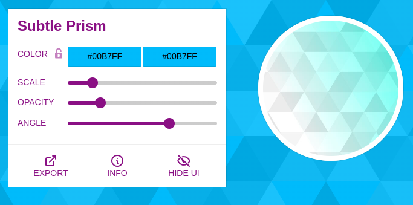
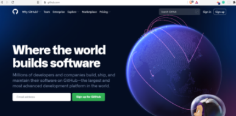

# FCB Portfolio - Github

## Objectives

- Build the Skeleton of the Web Developer Portfolio
- Add Styling to the Portfolio
- Deploy the LIVE Web Developer Portfolio in Github Pages

#### Create Your Project in your Local Machine

1. Writing the `pwd` (present working directory) command in the Command Line should return a value of the location you are currently in. (Instructor to show his `pwd`). Our desired output should show that we are inside the `Documents` folder.
1. Inside your `Documents` folder, create a folder called `fcb-portfolio` by executing the command `mkdir fcb-portfolio`
1. Open your `Sublime Text` Application
1. Select on `File`
1. Select on `Open Folder`
1. Select the `fcb-portfolio` folder inside `Documents` and click Open Folder
1. `fcb-portfolio` folder showed now appear at the left side panel of the `Sublime Text` application
1. Right click on the `fcb-portfolio` and select new file
   
1. Type `index.html` in the newly opened tab and press save. A new file called index.html file should appear inside the fcbportfolio folder
   
1. Right click on the fcb-portfolio folder again and create the `style.css` file and `images` folder.
   

### Build the Skeleton of the Web Developer Portfolio

The `HTML` document is considered the building blocks/foundation of websites. All styling will be placed inside a separate stylesheet called a `CSS` file. We will use the text editor called `Sublime Text` to write our code.

- Double click on the `index.html` file.
- Create a boilerplate for `index.html` file by typing in the opening tag `<html` then click tab.
- Inside the `index.html` tab and change the value of the `<title>` to `"John Doe | Web Developer Portfolio"` (alternatively, John Doe can be replaced by your own name).

```html
<!DOCTYPE html>
<html>
<head>
	<meta charset="utf-8">
	<meta name="viewport" content="width=device-width, initial-scale=1">
	<title>John Doe | Web Developer Portfolio</title>
</head>
<body>

</body>
</html>
```

- Right click anywhere inside the file and select open in browser. Show that the value inputted in the title is seen in the browser tab.
- The output that we see in our browser are the elements inside the `HTML` element called `<body>` tag.

* Inside `<body>`, create a `<div>` element with the `class="container"` that will serve as the wrapper of our whole layout.

```html
<div class="container"></div>
```

- Inside the `<div>`, add 1 `<section>` element with an `id` called `landing`.

```html
<div class="container">
	<section id="landing"></section>
```
- Create comments for proper documentation. Comments are ignored by the browser and do not show as text. 
- Use `ctrl + slash` to create a comment

```html
<!-- div creates a wrapper/container for our layout -->
<!-- class is an attribute to name our div -->
<div class="container">
	<!-- id is an attribute to name a tag uniquely -->
	<section id="landing"></section>
<!-- end landing -->
</div>
```
- Inside `#landing`, add an `<h1>` element with `Full Stack Web Developer` as its value. Save and refresh the browser to check the output.
- Add a `<p>` element to add a short description of the developer.

```html
<section id="landing">
	<h1>Full Stack Web Developer</h1>
	<p>Hi! My name is John and I love building things from scratch.</p>
</section>
```
- Let's add a profile picture.
- Download an image of yourself and place it inside your `fcb-portfolio > images` folder.  
  As much as possible, make sure the that size of the `height` and `width` of the image are equal.  
  If not, at least the image is almost square in shape.
- Make sure to have a proper file extension for images, such as `jpg, jpeg, png, svg`.
- Add `` with an `id` called `profile`.

```html
	<p>Hi! My name is John and I love building things from scratch.</p>
	
</section>
```
- Add an `<a>` tag with `href="mailto:"emailOfRecipient"` that will set the link to open the default mail application in your machine.
- For Windows and Mac, the default mail app is `Mail` while in Ubuntu is `Thunderbird Mail`.
- `mailto:` parameter specifies the email address of the recipient.
- For multiple recipients, separate them with a comma.

```html
	
	<a href="mailto:charles.quimpo@zuitt.co">Let's Work Together</a>
</section>
```

- now let's add our styling

### Add Styling to the Portfolio

After creating the skeleton, we will now add styling to our webpage

#### Choose the font style/s that we will use

- Connect the external CSS to the html file by adding a `<link>` tag.

```html
<title>John Doe | Web Developer Portfolio</title>
<!-- external css -->
<link rel="stylesheet" href="style.css">
```

- Go to [Google Fonts](https://fonts.google.com)
- Select _Montserrat Semi-Bold 600_ and _Roboto Regular 400_
- Copy the link and place it inside `<head>...</head>` tags

```html
<!-- Google Fonts -->
<link rel="preconnect" href="https://fonts.gstatic.com" />
<link
	href="https://fonts.googleapis.com/css2?family=Montserrat:wght@600&family=Roboto&display=swap"
	rel="stylesheet"
/>
```

- Open up your `style.css` file, and remove everything inside it
- Let's declare a default font style.  
  The `*` universal selector selects all HTML elements.  
  Targetting it will enable us to declare a font style for all html elements.  
  Declaring a default font enables us to control how our text will look and not rely with what the browser gives us.

```css
/* 
	Syntax for CSS
	selector {
		property: value;
	}
*/
* {
	font-family: "Roboto", sans-serif;
}
```

- Next, let's select our heading element, `h1` along with the `p` tag. Declare Montserrat as the `font-family` for the said elements.

```css
h1, p {
	font-family: "Montserrat", sans-serif;
}
```
- Then, resize the image `height` and `width`.
- Please note that the given image here, `me.png` has a transparent background thus the circular shape of the image provided.

```css
#profile {
	height: 250px;
	width: 250px;

	/* [optional] add a border-radius to create a circular shape to mimic the sample output */
	border-radius: 50%;
}
```
- Add a background image from [SVG Backgrounds](https://www.svgbackgrounds.com/)
- Select the background pattern and set the color shade 
- Once selected, click `Export` and copy and paste the background by choosing CSS.
- `background-color` - sets the background color for a page
- `background-image` - sets the background image for the page
- `background-attachment: fixed;` -  background-attachment sets whether the background image will scroll with the rest of the page or not, `fixed` value will not scroll with the page.
- `background-size: cover;` - background-size specifies the size of the background image, `cover` value will stretch or cut the background image to occupy the whole container of the page. 


```css
body {
	background-color: #00B7FF;
	background-image: url("data:image/svg+xml,%3Csvg xmlns='http://www.w3.org/2000/svg' width='100%25'%3E%3Cdefs%3E%3ClinearGradient id='a' gradientUnits='userSpaceOnUse' x1='0' x2='0' y1='0' y2='100%25' gradientTransform='rotate(240)'%3E%3Cstop offset='0' stop-color='%2300B7FF'/%3E%3Cstop offset='1' stop-color='%2300B7FF'/%3E%3C/linearGradient%3E%3Cpattern patternUnits='userSpaceOnUse' id='b' width='540' height='450' x='0' y='0' viewBox='0 0 1080 900'%3E%3Cg fill-opacity='0.1'%3E%3Cpolygon fill='%23444' points='90 150 0 300 180 300'/%3E%3Cpolygon points='90 150 180 0 0 0'/%3E%3Cpolygon fill='%23AAA' points='270 150 360 0 180 0'/%3E%3Cpolygon fill='%23DDD' points='450 150 360 300 540 300'/%3E%3Cpolygon fill='%23999' points='450 150 540 0 360 0'/%3E%3Cpolygon points='630 150 540 300 720 300'/%3E%3Cpolygon fill='%23DDD' points='630 150 720 0 540 0'/%3E%3Cpolygon fill='%23444' points='810 150 720 300 900 300'/%3E%3Cpolygon fill='%23FFF' points='810 150 900 0 720 0'/%3E%3Cpolygon fill='%23DDD' points='990 150 900 300 1080 300'/%3E%3Cpolygon fill='%23444' points='990 150 1080 0 900 0'/%3E%3Cpolygon fill='%23DDD' points='90 450 0 600 180 600'/%3E%3Cpolygon points='90 450 180 300 0 300'/%3E%3Cpolygon fill='%23666' points='270 450 180 600 360 600'/%3E%3Cpolygon fill='%23AAA' points='270 450 360 300 180 300'/%3E%3Cpolygon fill='%23DDD' points='450 450 360 600 540 600'/%3E%3Cpolygon fill='%23999' points='450 450 540 300 360 300'/%3E%3Cpolygon fill='%23999' points='630 450 540 600 720 600'/%3E%3Cpolygon fill='%23FFF' points='630 450 720 300 540 300'/%3E%3Cpolygon points='810 450 720 600 900 600'/%3E%3Cpolygon fill='%23DDD' points='810 450 900 300 720 300'/%3E%3Cpolygon fill='%23AAA' points='990 450 900 600 1080 600'/%3E%3Cpolygon fill='%23444' points='990 450 1080 300 900 300'/%3E%3Cpolygon fill='%23222' points='90 750 0 900 180 900'/%3E%3Cpolygon points='270 750 180 900 360 900'/%3E%3Cpolygon fill='%23DDD' points='270 750 360 600 180 600'/%3E%3Cpolygon points='450 750 540 600 360 600'/%3E%3Cpolygon points='630 750 540 900 720 900'/%3E%3Cpolygon fill='%23444' points='630 750 720 600 540 600'/%3E%3Cpolygon fill='%23AAA' points='810 750 720 900 900 900'/%3E%3Cpolygon fill='%23666' points='810 750 900 600 720 600'/%3E%3Cpolygon fill='%23999' points='990 750 900 900 1080 900'/%3E%3Cpolygon fill='%23999' points='180 0 90 150 270 150'/%3E%3Cpolygon fill='%23444' points='360 0 270 150 450 150'/%3E%3Cpolygon fill='%23FFF' points='540 0 450 150 630 150'/%3E%3Cpolygon points='900 0 810 150 990 150'/%3E%3Cpolygon fill='%23222' points='0 300 -90 450 90 450'/%3E%3Cpolygon fill='%23FFF' points='0 300 90 150 -90 150'/%3E%3Cpolygon fill='%23FFF' points='180 300 90 450 270 450'/%3E%3Cpolygon fill='%23666' points='180 300 270 150 90 150'/%3E%3Cpolygon fill='%23222' points='360 300 270 450 450 450'/%3E%3Cpolygon fill='%23FFF' points='360 300 450 150 270 150'/%3E%3Cpolygon fill='%23444' points='540 300 450 450 630 450'/%3E%3Cpolygon fill='%23222' points='540 300 630 150 450 150'/%3E%3Cpolygon fill='%23AAA' points='720 300 630 450 810 450'/%3E%3Cpolygon fill='%23666' points='720 300 810 150 630 150'/%3E%3Cpolygon fill='%23FFF' points='900 300 810 450 990 450'/%3E%3Cpolygon fill='%23999' points='900 300 990 150 810 150'/%3E%3Cpolygon points='0 600 -90 750 90 750'/%3E%3Cpolygon fill='%23666' points='0 600 90 450 -90 450'/%3E%3Cpolygon fill='%23AAA' points='180 600 90 750 270 750'/%3E%3Cpolygon fill='%23444' points='180 600 270 450 90 450'/%3E%3Cpolygon fill='%23444' points='360 600 270 750 450 750'/%3E%3Cpolygon fill='%23999' points='360 600 450 450 270 450'/%3E%3Cpolygon fill='%23666' points='540 600 630 450 450 450'/%3E%3Cpolygon fill='%23222' points='720 600 630 750 810 750'/%3E%3Cpolygon fill='%23FFF' points='900 600 810 750 990 750'/%3E%3Cpolygon fill='%23222' points='900 600 990 450 810 450'/%3E%3Cpolygon fill='%23DDD' points='0 900 90 750 -90 750'/%3E%3Cpolygon fill='%23444' points='180 900 270 750 90 750'/%3E%3Cpolygon fill='%23FFF' points='360 900 450 750 270 750'/%3E%3Cpolygon fill='%23AAA' points='540 900 630 750 450 750'/%3E%3Cpolygon fill='%23FFF' points='720 900 810 750 630 750'/%3E%3Cpolygon fill='%23222' points='900 900 990 750 810 750'/%3E%3Cpolygon fill='%23222' points='1080 300 990 450 1170 450'/%3E%3Cpolygon fill='%23FFF' points='1080 300 1170 150 990 150'/%3E%3Cpolygon points='1080 600 990 750 1170 750'/%3E%3Cpolygon fill='%23666' points='1080 600 1170 450 990 450'/%3E%3Cpolygon fill='%23DDD' points='1080 900 1170 750 990 750'/%3E%3C/g%3E%3C/pattern%3E%3C/defs%3E%3Crect x='0' y='0' fill='url(%23a)' width='100%25' height='100%25'/%3E%3Crect x='0' y='0' fill='url(%23b)' width='100%25' height='100%25'/%3E%3C/svg%3E");

	background-attachment: fixed;
	background-size: cover;

}
```

#### Bootstrap

For clients and companies, time to market is as important as the tech stack you used to create a certain project.  
Bootstrap will enable us to develop mobile responsive layouts faster compared to using plain css.

- Go to https://getbootstrap.com/
- Go to `Docs` and select `v5.0.2` as this currently a stable version for v5 Bootstrap.
- Scroll down to the starter template version and copy the required meta tags and link to the CSS library of Bootstrap
- Paste it inside the head element of your project

  - Paste the Bootstrap CSS link before the our own CSS file

  ```html
  <head>
  	<!-- Required meta tags -->
  	<meta charset="utf-8" />
  	<meta name="viewport" content="width=device-width, initial-scale=1" />
  	<title>John Doe | Web Developer Portfolio</title>

  	<!-- Google Fonts -->
  	<link rel="preconnect" href="https://fonts.gstatic.com" />
  	<link
  		href="https://fonts.googleapis.com/css2?family=Montserrat:wght@600&family=Roboto&display=swap"
  		rel="stylesheet"
  	/>

  	<!-- Bootstrap CSS -->
	<link href="https://cdn.jsdelivr.net/npm/bootstrap@5.0.2/dist/css/bootstrap.min.css" rel="stylesheet" integrity="sha384-EVSTQN3/azprG1Anm3QDgpJLIm9Nao0Yz1ztcQTwFspd3yD65VohhpuuCOmLASjC" crossorigin="anonymous"
	>

  	<!-- External css -->
  	<link rel="stylesheet" href="style.css">
  </head>
  ```

- Copy the Bootstrap script dependencies and place it before the closing body tag

```html
	<!-- Option 1: jQuery and Bootstrap Bundle (includes Popper) -->
    <script src="https://cdn.jsdelivr.net/npm/bootstrap@5.0.2/dist/js/bootstrap.bundle.min.js" integrity="sha384-MrcW6ZMFYlzcLA8Nl+NtUVF0sA7MsXsP1UyJoMp4YLEuNSfAP+JcXn/tWtIaxVXM" crossorigin="anonymous"></script>
	</body>
```

- Did you notice the space that was generated after linking the Bootstrap dependencies?  
  This is because of the class container that we used for our div element.  
  By default, Bootstrap has 2 types of wrappers/containers that we can use so we can control the layout of our webpage.  
  Class `container` sets a `max-width`, hence the space at the sides.  
  Class `container-fluid` creates a fluid layout which will make our layout span the whole width of the screen.  
  Let's change the class `container` to `container-fluid` to achieve the fluid layout.

```html
<!-- creates a wrapper/container for our layout -->
<div class="container-fluid">
	<!-- ... -->
</div>
```

#### Adding Bootstrap styling to our Page

- Add the class `text-center` which centers the text horizontally
- Add the class `img-fluid` to the image to avoid the image from overflowing
- Add the class `mt-5` to add a top margin to our element

```html
<section class="text-center mt-5" id="landing">
	<h1>Full Stack Web Developer</h1>
	<p>Hi! My name is John and I love building things from scratch.</p>
	
	<a href="mailto:charles.quimpo@zuitt.co">Let's Work Together</a>
</section>
<!-- end landing -->
```
- Add Boostrap styling to `<a>` tag to transform it into a button.
- Add the class `btn` so that it will be treated as a button.
- Add the class `btn-success` to give color to the button. Other Bootstrap color classes: `danger, warning, primary, dark, white, transparent`.
- Add the class `btn-lg` to resize the button. Other sizes for buttons: `btn-sm`.
- Add the class `mt-3` to add margin on top of our element.

```html
	<a href="mailto:charles.quimpo@zuitt.co" class="btn btn-success btn-lg mt-3">Let's Work Together</a>
</section>
<!-- end landing -->
```

#### Add styling via external CSS

- Center the elements inside landing using `flexbox`
- `viewport height (vh)` - determined or measured percentage of the height of the device you are viewing your 
webpage in.
- `flex-direction: column;` - arranges flex items into a column.
- `justify-content: center;` - arranges elements horizontally if the flex items are in a row however, it arranges elements vertically if the flex items are in a column.
- `align-items: center;` - arranges all flex items to be centered vertically

```css
#landing {
	height: 80vh;
	/* center the content vertically using flexbox */
	display: flex;
	flex-direction: column;
	justify-content: center;
	align-items: center;
}
```


### Deploy the LIVE Web Developer Portfolio in Github Pages

In your machines, go to your Documents folder and right click on it

- For Windows users, select `Git Bash` Here from the options
- For Mac users, select `Open Terminal Here` or drag the `Documents` folder to the `Terminal` icon in the Dock
- For Linux users, select `Open Terminal`

- Reminders:
  - Pressing the up arrow key inside the CLI will return the last command you executed
  - While inputting your password, no keys will appear but you are actually already typing your password

- First, Connect your Github account through `git config`
- Input the username used in Github:
```bash
 $ git config --global user.name "Full username used in Github"
```
- To check the username input:
```bash
 $ git config --global user.name
```
- Input the email used in Github:
```bash
 $ git config --global user.email "Email used in Github"
```
- To check the email input:
```bash
 $ git config --global user.email
```

1. Writing the `pwd` (present working directory) command in the Command Line should return a value of the location you are currently in. (Instructor to show his `pwd`). Our desired output should show that we are inside the `Documents` folder.
1. Inside your `Documents` folder, go inside your project folder called `fcb-portfolio` by executing the command `cd fcb-portfolio`

#### Create a new `git` commit

- Inside the fcbportfolio folder, run the git init command. This will initialize Git to our project folder.

```bash
 $ git init
```

- Check the status of project's working directory.
  ```bash
  $ git status
  ```
- Add all existing changes to the staging area.
  ```bash
  $ git add -A
  ```
- Commit all changes from the staging area.
  ```bash
  $ git commit -m "<describe the changes>"
  ```

#### Add a remote repository

- Do not close your Terminal. Go to Github(https://www.github.com) and Login using your registered email.
  

- Once logged in, click on the `New Repository` button or the `Start a Project` button
  

- Name your remote project/repository as `fcbportfolio`. Leave the Permission to `Public` and click on Create Repository.
  

- Copy the `HTTPS URL` of your new project
  

- Go back to the Terminal and run the command `git remote add github <paste the HTTPS URL from your Github repository>`
  

### As of August 13, 2021, Github has removed simple username/password authentication. 

[Github Blog](https://github.blog/changelog/2021-08-12-git-password-authentication-is-shutting-down/)

## Instead, we have to create a personal access token:

	Go to your github profile and select settings.

	Then, in your settings, scroll down to the left pane and select developer settings.

	Then, in developer settings, select Personal Access Tokens.

	Then, add your note and expiration date:


	Then, generate new token with the following scopes checked:

		repo 
		repo:status 
		repo_deployment 
		public_repo 
		repo:invite 
		security_events 
		read:repo_hook 
		delete_repo


	Then, generate your token and use the token as the password instead.

#### Push all commits to a remote `git` repository

- Check connected remote `git` repositories.
  ```bash
  $ git remote -v
  ```
- Push to target remote `git` repository.

  ````bash
  	$ git push <remote> <branch>
  	$ git push github master
  	```
  **NOTE:**
  ````
- Exit any pop-ups that will appear during pushing and proceed with putting the credentials in the terminal.
- Enable GitHub Pages of our project.  
  `fcb-portfolio > Settings > Pages > Source`  
  Set branch from `None` to `master` and the destination folder should be `root`. Click `Save`.  
    
  Doing this will deploy the project and will create a new link.  
  

#### The End
